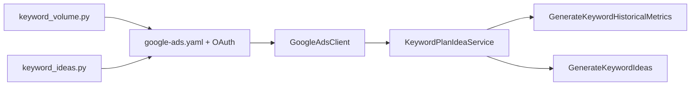

# Google Ads 关键词工具 — 技术方案

## 1. 目标

1. `GenerateKeywordHistoricalMetrics`：输入已知关键词，获取历史搜索指标。
2. `GenerateKeywordIdeas`：输入 seed 词 / URL / 站点，返回衍生关键词及同样的历史指标。

输出方式可选：Python 数据结构、JSON（`--json`）、终端表格、CSV（`--csv`）。

## 2. 架构



### 模块职责

| 文件 | 职责 |
|------|------|
| `keyword_volume.py` | 搜索量 CLI、字段解析、表格/CSV、共享认证 helper |
| `keyword_ideas.py` | 拓词 CLI；复用 volume 的解析与输出 |
| `generate_refresh_token.py` | Desktop OAuth 授权，生成 `google-ads.yaml` |
| `run_example.sh` | 一键跑中英文示例关键词 |
| `tests/test_keyword_volume.py` | 搜索量单元测试 |
| `tests/test_keyword_ideas.py` | 拓词单元测试 |

## 3. API 设计

### 3.1 调用接口

```
KeywordPlanIdeaService.GenerateKeywordHistoricalMetrics
```

官方参考：[GenerateKeywordHistoricalMetricsResult](https://developers.google.com/google-ads/api/reference/rpc/latest/GenerateKeywordHistoricalMetricsResult)

### 3.2 请求参数

| 参数 | 脚本对应 | 默认值 | 说明 |
|------|----------|--------|------|
| `customer_id` | `--customer-id` | 必填 | API 操作客户 ID |
| `keywords[]` |  positional args | 必填 | 关键词列表 |
| `geo_target_constants[]` | `--geo-target-id`（可重复） | 不传 | 地域常量；**不传 = worldwide**（2156=中国，2840=美国） |
| `language` | `--language-id` | 不传 | 语言常量；**不传 = 不限语言**（1017=简体中文，1000=英语） |
| `keyword_plan_network` | 固定 | `GOOGLE_SEARCH` | 仅 Google 搜索网络 |
| `historical_metrics_options.include_average_cpc` | 固定 `true` | — | 请求返回平均 CPC |

`login_customer_id` 不放在请求体里，由客户端配置指定（MCC 登录身份）。

### 3.3 响应字段

#### 顶层 `GenerateKeywordHistoricalMetricsResponse`

| 字段 | 脚本是否使用 |
|------|-------------|
| `results[]` | ✅ |
| `aggregate_metric_results` | ❌（未请求汇总指标） |

#### 每条结果 `GenerateKeywordHistoricalMetricsResult`

| API 字段 | 脚本输出列 | 说明 |
|----------|-----------|------|
| `text` | `keyword` | 去重后的主查询词 |
| `close_variants[]` | `close_variants` | 被合并的原始变体，`list[str]` |
| `keyword_metrics.avg_monthly_searches` | `average_monthly_searches` | 过去 12 个月月均搜索量 |
| `keyword_metrics.competition` | `competition` | `LOW` / `MEDIUM` / `HIGH` |
| `keyword_metrics.competition_index` | `competition_index` | 0–100，数据不足时为 null |
| `keyword_metrics.average_cpc_micros` | `average_cpc` | 除以 1,000,000 转为 USD |
| `keyword_metrics.low_top_of_page_bid_micros` | `low_top_of_page_bid` | 首页出价低位（20 分位） |
| `keyword_metrics.high_top_of_page_bid_micros` | `high_top_of_page_bid` | 首页出价高位（80 分位） |
| `keyword_metrics.monthly_search_volumes[]` | `monthly_search_volumes` | `list[dict]`，CSV 中序列化为 JSON |

`monthly_search_volumes` 每项结构：

```json
{"year": 2026, "month": "JULY", "monthly_searches": 2740000}
```

### 3.4 输出格式

**Python API**（推荐程序化调用）：`fetch_keyword_metrics()` 返回 `list[dict]`，字段为结构化数据，`monthly_search_volumes` 为数组。

**CLI `--json`**：将完整结果打印到 stdout，不写文件。

**终端表格**（默认）：摘要字段，不含 `monthly_search_volumes`。

**CSV**（`--csv`，可选）：仅在需要落盘时使用；`close_variants` 与 `monthly_search_volumes` 在 CSV 中为字符串。

**CSV 列顺序**（使用 `--csv` 时）：

```
keyword, close_variants, average_monthly_searches, competition,
competition_index, average_cpc, low_top_of_page_bid, high_top_of_page_bid,
monthly_search_volumes
```

结果按 `average_monthly_searches` 降序排列。

### 3.5 拓词接口

```
KeywordPlanIdeaService.GenerateKeywordIdeas
```

| 参数 | 脚本对应 | 默认 | 说明 |
|------|----------|------|------|
| `keyword_seed` / `url_seed` / `keyword_and_url_seed` / `site_seed` | 位置参数 / `--url` / `--site` | 至少其一 | 四选一；关键词+URL 走 KeywordAndUrlSeed |
| `geo_target_constants[]` | `--geo-target-id` | 不传 = worldwide | 与搜索量工具相同 |
| `language` | `--language-id` | `1017` | 与搜索量工具相同 |
| `page_size` | `--limit` | `50`（最大 1000） | 取前 N 条后停止分页 |
| `include_adult_keywords` | 固定 `false` | — | 不含成人词 |

每条 `GenerateKeywordIdeaResult` 的 `keyword_idea_metrics` / `close_variants` 映射到与搜索量工具相同的输出列。

## 4. 认证与账号

### 4.1 凭据链

```
Developer Token (.env 或 google-ads.yaml)
    +
OAuth Desktop Client (client_id / client_secret / refresh_token)
    +
login_customer_id + customer_id
    →
GoogleAdsClient → API 调用
```

### 4.2 配置文件

`google-ads.yaml`（本地，不入库）：

```yaml
developer_token: "<从 API Center 读取>"
client_id: "<OAuth JSON>"
client_secret: "<OAuth JSON>"
refresh_token: "<generate_refresh_token.py 生成>"
login_customer_id: "2748189611"   # 生产 MCC；Test Access 下查询时需 CLI 覆盖
use_proto_plus: true
```

开发者令牌也可通过环境变量 `GOOGLE_ADS_DEVELOPER_TOKEN` 传入授权脚本。

`GoogleAdsClient.load_from_storage()` 不支持 kwargs 覆盖 `login_customer_id`，脚本使用 `load_from_dict` 实现 `--login-customer-id` 覆盖。

### 4.3 Google Ads 账号结构

| 客户 ID | 角色 | API 使用 |
|---------|------|----------|
| `2748189611` | 生产 MCC，API Center 在此 | Test Access 下**不可直接查询** |
| `1265134925` | 测试经理账号 | **当前所有 API 查询使用此 ID** |
| `3770104529` | 多余经理账号 | 可忽略，不影响工具 |

当前开发者令牌权限：**Test Account Access**。要查生产 MCC 真实数据，需在 API Center 申请 **Basic Access**。

### 4.4 日常查询命令

```bash
cd ~/Projects/keyword-kits/packages/google-ads
source .venv/bin/activate

python keyword_volume.py \
  --login-customer-id 1265134925 \
  --customer-id 1265134925 \
  --geo-target-id 2840 \
  --language-id 1000 \
  "keyword one" "keyword two" \
  --csv results.csv
```

## 5. 环境与依赖

- Python 3.10+
- 依赖见 `requirements.txt`：`google-ads`、`google-auth-oauthlib`

```bash
python3 -m venv .venv
source .venv/bin/activate
pip install -r requirements.txt
```

## 6. 首次授权流程

1. `chmod 600` OAuth JSON
2. 设置 `GOOGLE_ADS_DEVELOPER_TOKEN`（可选）
3. 运行 `generate_refresh_token.py`，浏览器用 `gengliming110@gmail.com` 授权
4. 生成 `google-ads.yaml`
5. `./run_example.sh` 或单元测试验证

## 7. 安全

**禁止提交到 Git：**

- `.env`
- `google-ads.yaml`
- OAuth JSON / client secret / refresh token / developer token
- 查询结果 CSV（本地输出）

`.gitignore` 已覆盖上述文件。错误处理不打印完整令牌。

## 8. 测试

```bash
python3 -m unittest discover -s tests -v
```

覆盖：客户 ID 清洗、排序、micros 转换、字段解析、CSV 列、请求构建（含 `include_average_cpc`）。

## 9. 常见错误

| 错误 | 原因 | 处理 |
|------|------|------|
| `DEVELOPER_TOKEN_NOT_APPROVED` | Test Access 查生产账号 | 改用 `1265134925` + `--login-customer-id` |
| `CUSTOMER_NOT_ENABLED` | 账号未启用/已删除 | 换有效 customer_id |
| `Config file not found` | 缺少 `google-ads.yaml` | 运行 `generate_refresh_token.py` |

## 10. 扩展方向（未实现）

- 输出 `aggregate_metric_results`（按设备汇总）
- 自定义 `year_month_range` 月份范围
- Basic Access 通过后切换生产 MCC 为默认 customer
- 批量关键词文件输入（`--input keywords.txt`）
